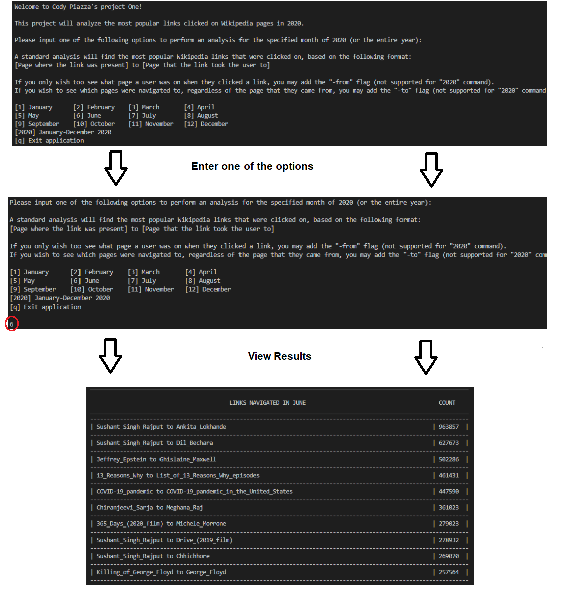

# WIKIPEDIA CLICKSTREAM ANALYSIS
# Project Description
Scala application that utilizes Hadoop and Hive to process Wikipedia data and find the most popular Wikipedia article links that were clicked on.

# Technologies Used
- Scala
- Hadoop (HDFS, YARN, MapReduce)
- Hive

# Features

## Current:
- Ability to see top ten most popular links clicked for each month
- User can specify a specific month or the entire year of 2020
- Optional flags allow user to target different parameters (see "Usage" for more detail)

## To-Do:
- Add support for previous years
- Add support for additional optional flags

# Requirements
- [JDK version 8 or 11](https://adoptopenjdk.net/)
- [Scala and SBT](https://www.scala-lang.org/download/2.12.8.html)
- [Hortonworks HDP Sandbox](https://www.cloudera.com/downloads/hortonworks-sandbox/hdp.html) preconfigured with Hive tables of Wiki data and Hive Query command files.

# Usage
1. Ensure above requirements are met
2. Navigate to your desired work folder and run the shell command:
```bash
git clone https://github.com/revature-scalawags/CodyProjectOne_Core.git
```
3. Start program in the shell with:
```bash
sbt --error run
```
4. Once program loads, enter a number between 1 and 12 to run a Hive query that will find the top ten links on Wikipedia that were clicked in a particular month of 2020. User may just enter "2020" to see results for the entire year. The results listed will be clicks that led from one Wikipedia page to another.
    - Example: Entering "1" will return the top 10 links clicked on in January 2020, along with displaying the site that the link was present on when clicked, and the destination site that this link led to.
    - User may also specify flags "-from" or "-to" after their input number (**only supported for individual months**)
        - "-from" will return the total amount of clicks on links **from** a particular Wikipedia page, **regardless of where that clicked link led to.**
        - "-to" will return the total amount of clicks that **led to** a particular Wikipedia page, **regardless of which Wikipedia page the user was on when they clicked the link.**


